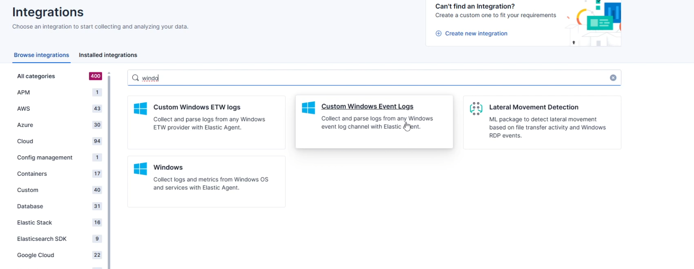
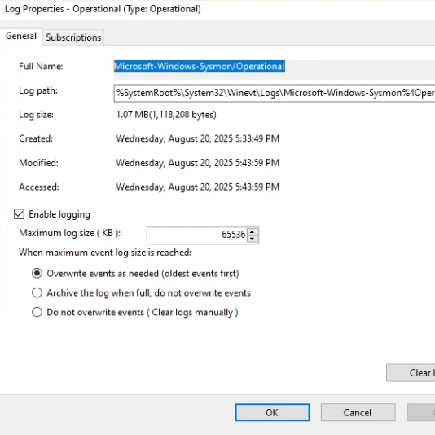
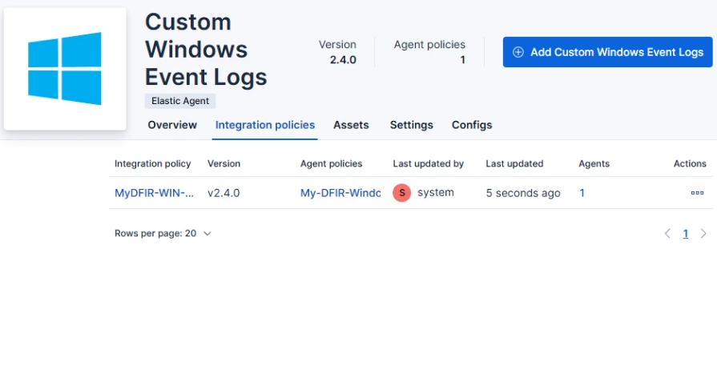
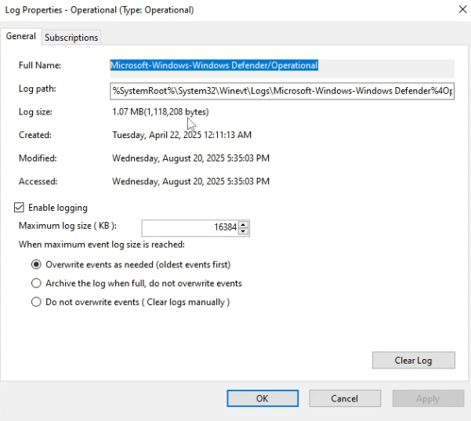
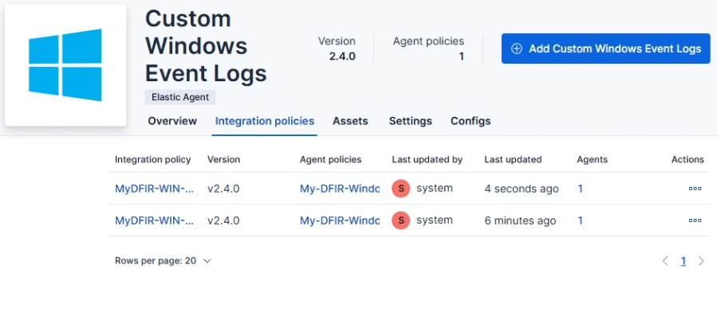

# 🧲 Ingest Sysmon & Windows Defender Logs into Elasticsearch (Elastic Agent + Custom Windows Event Logs)

This project shows how I used **Kibana Integrations → Custom Windows Event Logs** to ingest **Sysmon** and **Windows Defender** events from a Windows host into **Elasticsearch**, including how I pulled the correct **channel names** from Event Viewer and limited event volume by specifying **Defender event IDs**.

> 🔐 I blur/redact real IPs, hostnames, and usernames in screenshots. Use placeholders like `203.0.113.25` (public) and `10.0.0.x` (private).

---

## 📌 Project Overview
- **Stack:** Elasticsearch + Kibana (Elastic Agent / Fleet already set up in prior lab)
- **Windows Host:** Existing agent enrolled to **Windows policy**
- **Goal:** Ingest Sysmon & Windows Defender logs via the **Custom Windows Event Logs** integration
- **Scope:** UI-driven config in Kibana; copy channel names from Event Viewer; validate in Discover

---

## 🧱 Lab Architecture

| Component                     | Role                                   | Notes / Ports |
|------------------------------|----------------------------------------|---------------|
| Windows Server (Agent)       | Log source: Sysmon & Windows Defender  | Agent enrolled to **Windows policy** |
| Fleet Server                 | Agent mgmt / policy                     | 8220/tcp (restricted) |
| Elasticsearch                | Storage / search                        | 9200/tcp (see notes below) |
| Kibana                       | UI                                      | 5601/tcp (from my IP) |

📸 *Diagram placeholder*  


---

## ✅ Prerequisites
- Kibana reachable (e.g., `http://<kibana-ip>:5601`)
- Fleet Server + Elastic Agent already working from prior lab
- A **Windows Agent** already online in **Fleet → Agents**
- RDP access to the Windows host to look up event channel names in Event Viewer

---

## 🛠️ Steps (What I Actually Did)

### **Step 1 — Open Integrations**
- Log into Kibana
- **Management → Integrations**
- Search for **“Custom Windows Event Logs”** and open it

📸 *Screenshot:*  


---

### **Step 2 — Add Sysmon via Custom Windows Event Logs**
1) Click **Add Custom Windows Event Logs**  
2) Fill in:
   - **Integration name:** `WIN - Sysmon`
   - **Description:** `Collect Sysmon logs`
3) **Channel name:**  
   - RDP into the Windows server → open **Event Viewer**  
   - Expand **Applications and Services Logs → Microsoft → Windows → Sysmon**  
   - Right-click **Operational → Properties**  
   - Copy the **Full Name** (channel name) and paste it into Kibana’s **Channel name** field
4) Leave the rest at **defaults**
5) **Where to add this integration:** choose **Existing hosts**
6) **Agent policy:** select the Windows policy created in the previous lab (e.g., **Windows policy**)
7) Click **Save and continue** → **Deploy changes**

📸 *Screenshots:*  
  


---

### **Step 3 — Add Windows Defender via Custom Windows Event Logs**
Repeat the process for **Windows Defender**:

1) **Add Custom Windows Event Logs**  
2) **Integration name:** `WIN - Defender`  
   **Description:** `Collect Windows Defender logs`
3) **Channel name:**  
   - Event Viewer → **Applications and Services Logs → Microsoft → Windows → Windows Defender**  
   - Right-click **Operational → Properties**  
   - Copy **Full Name** and paste into Kibana **Channel name**
4) **Event IDs (lab filter):** add `1116, 1117, 5001`  
   *(This reduces noise for the lab and focuses on useful Defender events.)*
5) **Where to add this integration:** choose **Existing hosts**  
   **Agent policy:** **Windows policy**  
6) **Save and continue** → **Deploy changes**

📸 *Screenshots:*  
  


---

### **Step 4 — Validate Data in Kibana (Discover)**
Open **Discover** and run quick KQL checks:

**Sysmon**
```kql
event.provider: "Microsoft-Windows-Sysmon"
Windows Defender (lab filter)

kql
Copy code
event.provider: "Microsoft-Windows-Windows Defender" AND event.code: (1116 or 1117 or 5001)
You should see recent documents flowing in from both sources.

📸 Screenshots:


🧩 Troubleshooting (What I Hit)
Symptom	Cause	What I Did	Safer Final Recommendation
Agent showed CPU/Memory = N/A in Fleet	Connectivity from components to Elasticsearch 9200/tcp was blocked	In Vultr Firewall Group, I temporarily changed inbound IPv4 to TCP 9200 from Anywhere → metrics appeared	Do not leave 9200 open to the world. Restrict 9200 to Fleet Server’s IP (and Kibana host if separate), or keep it private on VPC. Keep 5601 and SSH/RDP limited to your IP
No Sysmon/Defender docs in Discover	Wrong channel name	Re-copied Full Name from Event Viewer → Properties and pasted into Channel name	Double-check exact channel path; avoid typos
Integration saved but no data	Integration not applied to correct hosts	Re-applied to Existing hosts under the Windows policy	Confirm target agent shows Policy updated in Fleet

🔐 After confirming data, roll back the temporary “9200 from anywhere” rule to a narrow allowlist (Fleet server IP only) or private networking.

📸 Screenshot Checklist
swift
Copy code
/screenshots/
├── ingest-architecture.png
├── kibana-integrations-catalog.png
├── eventviewer-sysmon-operational-props.png
├── kibana-custom-winevent-sysmon.png
├── eventviewer-defender-operational-props.png
├── kibana-custom-winevent-defender.png
├── kibana-discover-sysmon.png
├── kibana-discover-defender.png
├── fleet-agents-policy-updated.png
└── vultr-firewall-9200-temp-and-final.png
(Name files in kebab-case. Keep them in /screenshots/ and reference as shown above.)

📚 References
Kibana Integrations → Custom Windows Event Logs (UI flow)

My prior repo: Elastic Agent & Fleet Server Setup (base environment + Windows policy)

Windows Event Viewer channel paths for Sysmon and Windows Defender

🏁 Results
Sysmon and Windows Defender events are flowing into Elasticsearch via the Custom Windows Event Logs integration

Kibana Discover shows results for event.provider: "Microsoft-Windows-Sysmon" and event.provider: "Microsoft-Windows-Windows Defender" with event.code: (1116, 1117, 5001)

Temporary 9200 rule resolved metrics; finalized with restricted firewall rules for safety
